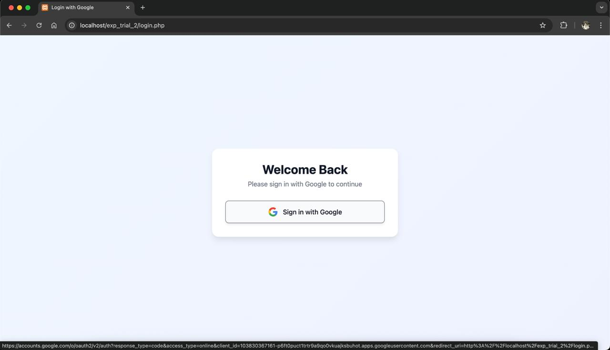
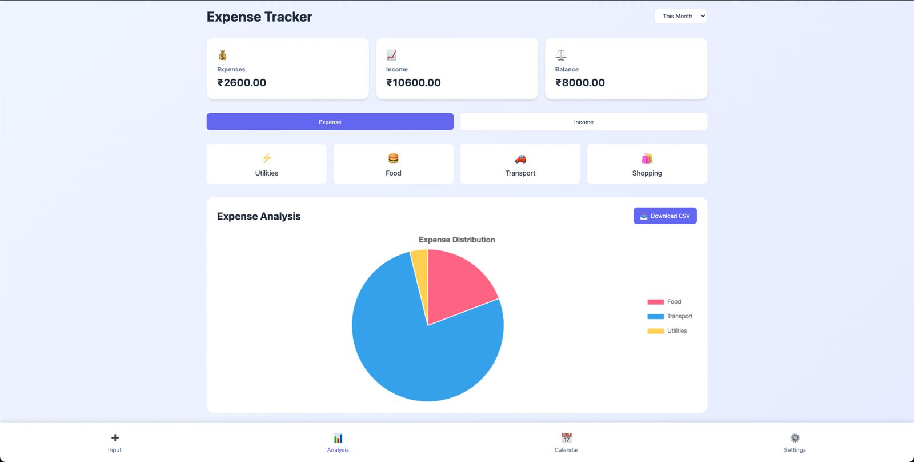
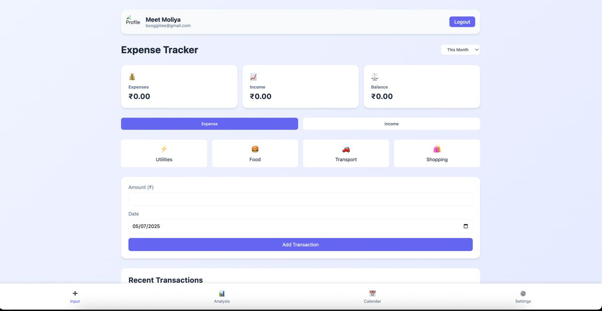

# 💸 Student Expense Management System

A simple web-based application designed for students to manage and track their income and daily expenses. It provides insightful charts and clean visuals to help users stay on top of their spending habits.

---

## ✨ Features

- 🔐 User Authentication (Login / Register)
- ➕ Add Income and Expenses
- 🗂️ Categorize Transactions
- 📆 Filter by Date
- 📊 Pie Chart Analysis (via Chart.js)
- 🧾 View & Delete Transactions
- 📤 Export Data to CSV

---

## 🛠️ Tech Stack

| Layer     | Technology           |
|-----------|----------------------|
| Frontend  | HTML, CSS, JavaScript |
| Backend   | PHP                  |
| Database  | MySQL                |
| Charts    | Chart.js             |

---

## 📸 Screenshots


### 🔐 Login Page  


### 📊 Dashboard with PieChart


### ➕ Add Transaction  


### 📅 Calender 


---

## 🧑‍💻 Getting Started

### ✅ Prerequisites

- [XAMPP](https://www.apachefriends.org/) or any local PHP + MySQL server

### 🚀 Setup Instructions

1. Clone the repo:

   ```bash
   git clone https://github.com/MeetMoliya06/Student-Expense-Management-System.git
   cd Student-Expense-Management-System

2. Import the SQL file (if any)
	•	Open XAMPP or similar
	•	Import the .sql file in phpMyAdmin

3. Run the project
	•	Place files in htdocs/ if using XAMPP
	•	Start Apache and MySQL
	•	Open http://localhost/Student-Expense-Management-System/ in your browser

---

🤝 Contributing

Pull requests are welcome. For major changes, please open an issue first to discuss what you’d like to change.

---

🙋‍♂️ Author

Made with ❤️ by Meet Moliya
